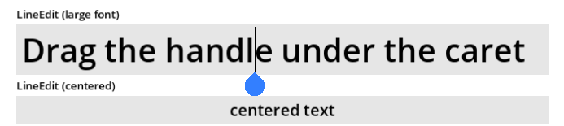
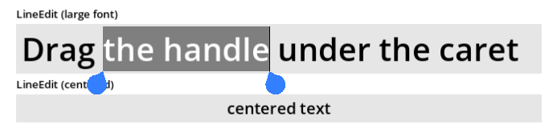
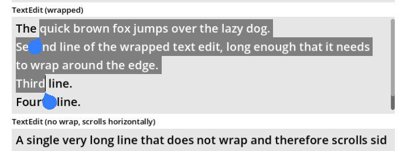
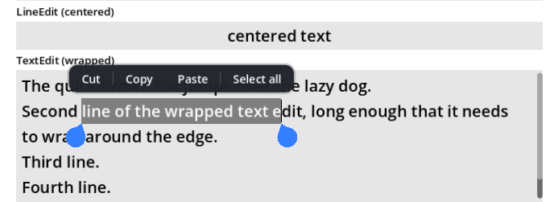

# Mobile Caret for Godot 4

Touch-friendly text carets and selection handles for Godot 4, in the style of Android. Drop it into your project and every `LineEdit` and `TextEdit` gets draggable handles, with no per-scene setup.

## Motivation

Godot's built-in caret is a thin line that is hard to see and almost impossible to place precisely with a finger. This plugin adds large, easy-to-grab handles so editing text on a phone feels natural.

## Screenshots

A caret handle under the caret in a `LineEdit`. Drag it to move the caret:



Two handles around a selection in a `LineEdit`:



A selection spanning several lines of a wrapped `TextEdit`:



The optional floating Cut / Copy / Paste / Select all toolbar:



## Features

* **Draggable caret handle:** a handle appears under the caret; drag it to move the caret.
* **Selection handles:** when text is selected, two handles mark the start and end. Drag either one to adjust the selection, and they can cross over each other.
* **Long-press to select a word.**
* **Smooth dragging:** the handle follows your finger while the caret snaps to the nearest character. Dragging past the edge of a control scrolls it.
* **Floating toolbar (optional):** an Android-style Cut / Copy / Paste / Select all bar above the selection. It lives in its own folder, nothing else depends on it, and it can be switched on and off from code.
* **Auto-fading caret handle:** the single caret handle fades out after a few seconds of inactivity and returns when you tap or move the caret. Selection handles stay visible.
* **Native caret hiding:** optionally hide Godot's own thin caret while a handle is shown, or only while dragging.
* **Works with what you already have:** supports `LineEdit`, `TextEdit`, `CodeEdit` and the `LineEdit` inside a `SpinBox` (including wrapped text, scrolling, gutters, alignment, clear buttons, secret fields and different font sizes) without changing your scenes. The text control keeps focus, so the on-screen keyboard stays up while you drag.
* **Right-to-left and mixed-direction text:** Hebrew, Arabic and mixed text get correctly placed handles, in left-to-right and right-to-left layouts.
* **Windows and SubViewports:** controls in a separate `Window`, an embedded window or a `SubViewport` get their handles and toolbar inside their own viewport.
* **Multiple carets:** a `TextEdit` with several carets gets handles for every caret, each draggable on its own.
* **Customizable:** use your own handle texture, size and color.

## Installation

1. Download the repository (or use the Asset Library) and copy `addons/MobileCaret` into your project's `addons/` folder.
2. Open *Project Settings > Plugins* and enable **MobileCaret**. This registers two autoloads: `MobileCaret` (the handles) and `MobileCaretToolbar` (the optional toolbar).

That's it. Run your project and focus any `LineEdit` or `TextEdit`.

If you prefer not to use the plugin, add `addons/MobileCaret/CaretsController/carets_controller.tscn` (and, if you want the toolbar, `addons/MobileCaret/Toolbar/caret_toolbar.tscn`) as autoloads yourself.

An example scene is included at `addons/MobileCaret/Examples/example_scene.tscn`.

## Usage

* **Move the caret:** drag the handle under the caret.
* **Select text:** long-press a word (or double-tap). Two handles appear; drag them to adjust the selection.
* **Replace or collapse a selection:** just type, or tap elsewhere, as usual.

### Settings

Select the `MobileCaret` autoload (or `carets_controller` node) and adjust its exported properties, or set them from code, for example `MobileCaret.handle_color = Color.ORANGE`.

#### Look

| Property | Description |
| --- | --- |
| `texture_caret` | Optional custom handle texture. Leave empty for the default teardrop. |
| `handle_size_mm` | Physical size of a handle in millimeters (default 7 × 8). The handle keeps this size on screen whatever the resolution, aspect ratio, stretch mode or screen DPI, and the hit margin, drag threshold and edge-scroll zones scale with it. Set to `(0, 0)` to use `handle_size` instead. |
| `handle_size` | Size of a handle in logical pixels. Used when `handle_size_mm` is `(0, 0)`. |
| `handle_color` | Color of the default teardrop. |
| `caret_texture_offset` | Extra offset applied to the handles. |
| `hit_margin` | Extra pixels around a handle that still count as touching it. |

#### Gestures

| Property | Description |
| --- | --- |
| `long_press_seconds` | How long to press to select a word. `0` disables long-press. |

#### Fade

| Property | Description |
| --- | --- |
| `caret_fade_delay` | Seconds of inactivity before the caret handle fades out. `0` or less disables fading. |
| `caret_fade_duration` | How long the fade takes, in seconds. |

#### Native caret

| Property | Description |
| --- | --- |
| `hide_native_caret` | Hide Godot's thin caret whenever a handle is shown. |
| `hide_native_caret_while_dragging` | Hide it only while a handle is being dragged (on by default). |

If a control already has its own `caret_color` override, it is restored exactly when the native caret is shown again.

### Floating toolbar

The toolbar (`addons/MobileCaret/Toolbar`) is a separate autoload, `MobileCaretToolbar`. Nothing in the handles' code depends on it: remove its autoload, or switch it off in code, and everything else works the same. If the `MobileCaret` controller is present the toolbar also listens to its `handle_tapped` signal; without it the toolbar still works from focus and selection alone. It works for `LineEdit`, `TextEdit`, `CodeEdit`, the `LineEdit` inside a `SpinBox` and selectable `RichTextLabel`s, in the main window and in any other `Window` or `SubViewport`. A `RichTextLabel` gets the toolbar only: Godot cannot set its selection from code, so there are no selection handles for it.

* It appears above a selection once the selection has settled and no mouse button is held, so it stays out of the way while you drag a handle. If there is no room above, it goes below the selection. It keeps its physical size, only shrinking when a small viewport is too narrow for it.
* It only offers what applies: Cut and Paste need an editable control, Paste needs something on the clipboard, and Select all is hidden when everything is already selected. A password field (`secret`) never offers Copy, Cut or Share.
* Tapping a caret handle (without dragging) shows Paste / Select all at the caret.
* Tapping inside an existing selection keeps the selection and shows or hides the toolbar, like Android.
* After Copy the selection stays and the toolbar hides until the selection changes (or you tap it). Typing or moving the caret hides it too.
* The **···** button opens an overflow menu with Undo, Redo and (optionally) Share; **‹** goes back.

Control it from code:

```gdscript
MobileCaretToolbar.enabled = false      # switch it off, and back on with true
MobileCaretToolbar.show_for_caret()     # show Paste / Select all at the caret now
MobileCaretToolbar.hide_toolbar()       # hide it until the selection changes
MobileCaretToolbar.action_pressed.connect(func(action): print(action))  # "cut", "copy", "paste", "select_all", "undo", "redo", "share"

# The Share button only shows when you turn it on; the toolbar cannot share by itself.
MobileCaretToolbar.show_share = true
MobileCaretToolbar.share_requested.connect(func(text): print("share: ", text))
```

| Property | Description |
| --- | --- |
| `enabled` | Master switch. |
| `show_cut`, `show_copy`, `show_paste`, `show_select_all` | Turn individual buttons off. |
| `text_cut`, `text_copy`, `text_paste`, `text_select_all` | Button labels (for localization). |
| `show_overflow`, `show_undo`, `show_redo`, `show_share` | The overflow menu and its entries (Share is off by default). |
| `text_undo`, `text_redo`, `text_share`, `text_more`, `text_back` | Labels for the overflow menu. |
| `tap_selection_toggles_toolbar` | Tapping inside a selection keeps it and toggles the toolbar (default on). Turn off to let such taps collapse the selection as usual. |
| `height_mm` | Height of the bar in millimeters (default 9). Like the handles it keeps this physical size on any screen. |
| `gap_mm` | Gap between the bar and the selection. |
| `background_color`, `text_color`, `pressed_color` | Colors. |
| `show_delay` | Seconds the selection must stay unchanged before the toolbar shows (default 0.2). |

## Compatibility

* Built and tested with Godot 4.7.
* Handles respond to mouse input, so touch must be emulated as mouse input. This is Godot and Contributions

Bug reports, ideas and pull requests are welcome.

## License

Released under the MIT License. See [LICENSE](LICENSE).
